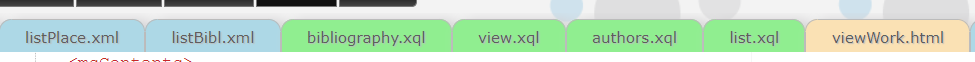

# eXide-customization - custom CSS

Use it with a browser extension like [Stylus](https://chrome.google.com/webstore/detail/stylus/clngdbkpkpeebahjckkjfobafhncgmne?hl=en).

## How to use it?

- Install the extension.
- Open eXide
- Click on the extension
- Select "Write style for" with the eXide URL
- Copy this code into the new Stylus window
- Give it a name, save it and it should work

## Scripts

- eXide-small_tweeks - general small tweeks to eXide
- eXide-color_tabs.css - colored tabs based on their type
 
- eXide-editor.css - higlight the active line in the editor
- eXide-manage_on_top.css - puts the "Manage" application in eXide on the top of the File menu
- eXide-folder_color.css - grays out default collections in the eXide menu and adds colors to some default subcollections (data, modules, resources) 

